# Market 365 (OpenMarket365) - Master Database Entity Relationship Diagram (ERD)
**Target Engine:** PostgreSQL 16+ on Supabase  
**Architecture:** 4 Autonomous Single-Owner Modules  
**Cost:** $0.00 / 0 EGP (Serverless Cloud Free Tier)

---

## 1. Master Entity Relationship Diagram (ERD)

```mermaid
erDiagram
    %% =========================================================================
    %% MODULE 1: IDENTITY, AUTH & SUBSCRIPTIONS (Seif Kassab)
    %% =========================================================================
    PROFILES {
        uuid id PK "references auth.users"
        user_role role "IMPORTER, EXPORTER, ADMIN"
        varchar full_name
        varchar company_name
        varchar country_code
        varchar business_phone
        varchar whatsapp_number
        boolean is_verified
        boolean private_browsing
        timestamptz created_at
    }

    SUBSCRIPTION_PLANS {
        subscription_tier tier_code PK "STD, PLS, PRM, ELT"
        varchar name_ar
        varchar name_en
        numeric annual_price_egp
        numeric annual_price_usd
    }

    PLAN_ENTITLEMENTS {
        subscription_tier tier_code PK, FK "references subscription_plans"
        int max_products
        int max_images
        boolean video_allowed
        int max_video_duration_minutes
        boolean dynamic_refresh_allowed
        int refresh_frequency_days
    }

    COMPANY_SUBSCRIPTIONS {
        uuid id PK
        uuid company_id FK "references companies"
        subscription_tier tier_code FK "references subscription_plans"
        subscription_status status "ACTIVE, EXPIRED, PENDING"
        timestamptz starts_at
        timestamptz expires_at
        timestamptz last_media_refresh_at
    }

    OFFLINE_PAYMENT_AUDITS {
        uuid id PK
        uuid subscription_id FK "references company_subscriptions"
        uuid recorded_by FK "references profiles"
        varchar bank_reference
        numeric amount_paid
        varchar currency
        date payment_date
        text receipt_document_url
    }

    %% =========================================================================
    %% MODULE 2: SHOWROOMS, CATALOG & COMPLIANCE (Karim Ayman)
    %% =========================================================================
    COMPANIES {
        uuid id PK
        uuid owner_id FK "references profiles"
        varchar corporate_name_ar
        varchar corporate_name_en
        varchar slug UK
        varchar cr_number UK "Commercial Reg No"
        varchar tax_id UK "Tax Card ID"
        varchar governorate
        varchar executive_phone
        varchar executive_whatsapp
        varchar executive_email
        text cr_document_url
        verification_status verification_status
        uuid verified_by FK "references profiles"
    }

    COMPANY_PROFILES {
        uuid company_id PK, FK "references companies"
        text logo_url
        text cover_banner_url
        text about_ar
        text about_en
        int facility_size_sqm
        int annual_capacity_mt
        text sorting_machinery
        int cold_storage_capacity_mt
        text_array export_port_history
        varchar youtube_video_id
        text_array featured_gallery_urls
    }

    SECTORS {
        int id PK
        varchar code UK
        varchar name_ar
        varchar name_en
        int display_order
    }

    COMMODITIES {
        int id PK
        int sector_id FK "references sectors"
        varchar code UK
        varchar name_ar
        varchar name_en
        varchar hs_code
    }

    PRODUCTS {
        uuid id PK
        uuid company_id FK "references companies"
        int commodity_id FK "references commodities"
        varchar title_ar
        varchar title_en
        numeric moq_value
        varchar moq_unit
        varchar packaging_type
        jsonb specifications "Dynamic specs"
        text_array image_urls
        tsvector search_tsv "Full Text Search Vector"
        boolean is_active
    }

    CERTIFICATES {
        int id PK
        varchar acronym UK "ISO_22000, GLOBALGAP, BRCGS, HALAL"
        varchar full_name
        varchar accreditation_body
    }

    COMPANY_CERTIFICATES {
        uuid id PK
        uuid company_id FK "references companies"
        int certificate_id FK "references certificates"
        varchar certificate_number
        date valid_from
        date valid_to
        text document_url
        verification_status status
        uuid audited_by FK "references profiles"
    }

    COUNTRY_REQUIREMENTS {
        int id PK
        varchar destination_country_code
        int commodity_id FK "references commodities"
        int mandatory_certificate_id FK "references certificates"
        text notes
    }

    %% =========================================================================
    %% MODULE 3: PROCUREMENT RFQ & TRADE BOARDS (GamalEldin)
    %% =========================================================================
    RFQS {
        uuid id PK
        uuid importer_id FK "references profiles"
        int commodity_id FK "references commodities"
        numeric required_quantity
        varchar quantity_unit
        varchar destination_country_code
        varchar destination_port
        varchar incoterm "FOB, CIF, CFR, EXW"
        date delivery_deadline
        timestamptz quote_deadline
        int_array mandatory_certificates
        text technical_specifications
        rfq_status status
    }

    QUOTES {
        uuid id PK
        uuid rfq_id FK "references rfqs"
        uuid exporter_company_id FK "references companies"
        numeric unit_price
        varchar currency
        varchar port_of_loading
        int lead_time_days
        timestamptz valid_until
        text commercial_terms
        quote_status status
    }

    RFQ_MATCHES {
        uuid id PK
        uuid rfq_id FK "references rfqs"
        uuid exporter_company_id FK "references companies"
        timestamptz notified_at
        timestamptz viewed_at
    }

    LOCAL_MARKET_LISTINGS {
        uuid id PK
        uuid company_id FK "references companies"
        int commodity_id FK "references commodities"
        varchar title
        numeric unit_price_egp
        numeric quantity_available
        varchar quality_grade
        varchar warehouse_governorate
        varchar seller_phone
        varchar seller_whatsapp
        timestamptz expires_at
        boolean is_active
    }

    DISTRESSED_CARGO_LISTINGS {
        uuid id PK
        uuid company_id FK "references companies"
        int commodity_id FK "references commodities"
        int container_count
        numeric net_weight_mt
        varchar current_port_location
        varchar current_country_code
        numeric target_discount_price_usd
        varchar bill_of_lading_number
        cargo_status status
    }

    %% =========================================================================
    %% MODULE 4: CLOUD, ADMIN & GOVERNANCE (Seif Amr)
    %% =========================================================================
    MEDIA_ASSETS {
        uuid id PK
        uuid uploaded_by FK "references profiles"
        varchar file_name
        varchar storage_key UK
        text public_url
        varchar mime_type
        bigint file_size_bytes
    }

    ARTICLES {
        uuid id PK
        uuid author_id FK "references profiles"
        varchar title_ar
        varchar title_en
        varchar slug UK
        text content_ar
        text content_en
        boolean is_published
        timestamptz published_at
    }

    TV_EPISODES {
        uuid id PK
        int episode_number UK
        varchar title_ar
        varchar title_en
        varchar youtube_video_id
        uuid_array featured_company_ids
        date air_date
    }

    GOVERNMENT_LINKS {
        int id PK
        varchar name_ar
        varchar name_en
        varchar category
        text portal_url
        int display_order
    }

    CONTACT_REVEALS {
        uuid id PK
        uuid importer_id FK "references profiles"
        uuid company_id FK "references companies"
        timestamptz revealed_at
    }

    ANALYTICS_EVENTS {
        uuid id PK
        varchar event_type "PROFILE_VIEW, VIDEO_PLAY"
        uuid company_id FK "references companies"
        uuid viewer_profile_id FK "references profiles"
        varchar search_keyword
        varchar ip_hash
        timestamptz created_at
    }

    AUDIT_LOGS {
        uuid id PK
        uuid actor_id FK "references profiles"
        varchar action
        varchar target_entity
        uuid target_id
        jsonb metadata
        timestamptz created_at
    }

    %% =========================================================================
    %% RELATIONSHIP MAPPINGS (Foreign Keys)
    %% =========================================================================
    
    %% Module 1 Internal & Cross-Connections
    SUBSCRIPTION_PLANS ||--|| PLAN_ENTITLEMENTS : "defines limits (1:1)"
    SUBSCRIPTION_PLANS ||--o{ COMPANY_SUBSCRIPTIONS : "subscribes (1:M)"
    COMPANY_SUBSCRIPTIONS ||--o{ OFFLINE_PAYMENT_AUDITS : "paid by (1:M)"
    PROFILES ||--o{ OFFLINE_PAYMENT_AUDITS : "records (1:M)"

    %% Module 2 Internal & Cross-Connections
    PROFILES ||--o{ COMPANIES : "owns (1:M)"
    PROFILES ||--o{ COMPANIES : "verifies (1:M)"
    COMPANIES ||--|| COMPANY_PROFILES : "showcase details (1:1)"
    COMPANIES ||--o{ COMPANY_SUBSCRIPTIONS : "holds (1:M)"
    
    SECTORS ||--o{ COMMODITIES : "groups (1:M)"
    COMMODITIES ||--o{ PRODUCTS : "categorizes (1:M)"
    COMPANIES ||--o{ PRODUCTS : "produces (1:M)"
    
    CERTIFICATES ||--o{ COMPANY_CERTIFICATES : "accredits (1:M)"
    COMPANIES ||--o{ COMPANY_CERTIFICATES : "holds (1:M)"
    PROFILES ||--o{ COMPANY_CERTIFICATES : "audits (1:M)"
    
    COMMODITIES ||--o{ COUNTRY_REQUIREMENTS : "mandates (1:M)"
    CERTIFICATES ||--o{ COUNTRY_REQUIREMENTS : "required by (1:M)"

    %% Module 3 Internal & Cross-Connections
    PROFILES ||--o{ RFQS : "posts inquiry (1:M)"
    COMMODITIES ||--o{ RFQS : "targets commodity (1:M)"
    
    RFQS ||--o{ QUOTES : "receives bids (1:M)"
    COMPANIES ||--o{ QUOTES : "submits bid (1:M)"
    
    RFQS ||--o{ RFQ_MATCHES : "broadcasts to (1:M)"
    COMPANIES ||--o{ RFQ_MATCHES : "alerted (1:M)"
    
    COMPANIES ||--o{ LOCAL_MARKET_LISTINGS : "posts surplus (1:M)"
    COMMODITIES ||--o{ LOCAL_MARKET_LISTINGS : "classifies surplus (1:M)"
    
    COMPANIES ||--o{ DISTRESSED_CARGO_LISTINGS : "sells cargo (1:M)"
    COMMODITIES ||--o{ DISTRESSED_CARGO_LISTINGS : "classifies cargo (1:M)"

    %% Module 4 Internal & Cross-Connections
    PROFILES ||--o{ MEDIA_ASSETS : "uploads (1:M)"
    PROFILES ||--o{ ARTICLES : "authors (1:M)"
    PROFILES ||--o{ AUDIT_LOGS : "executes (1:M)"
    
    PROFILES ||--o{ CONTACT_REVEALS : "unlocks (1:M)"
    COMPANIES ||--o{ CONTACT_REVEALS : "unlocked (1:M)"
    
    COMPANIES ||--o{ ANALYTICS_EVENTS : "viewed (1:M)"
    PROFILES ||--o{ ANALYTICS_EVENTS : "views (1:M)"
```



---

## 2. Master Table Connection & Foreign Key Map

The following matrix explains **every table connection**, its **cardinality**, the **foreign key column**, and its **business purpose**:

| # | Parent Table | Child Table | Foreign Key Column | Cardinality | Business Purpose & Connection Logic |
| :-: | :--- | :--- | :--- | :---: | :--- |
| **1** | `auth.users` | `public.profiles` | `profiles.id` | **1 : 1** | Links Supabase authentication identity to application profile and role (`IMPORTER`, `EXPORTER`, `ADMIN`). |
| **2** | `subscription_plans` | `plan_entitlements` | `plan_entitlements.tier_code` | **1 : 1** | Couples the subscription tier (`STD`, `PLS`, `PRM`, `ELT`) directly to its data-driven quota limits. |
| **3** | `subscription_plans` | `company_subscriptions` | `company_subscriptions.tier_code` | **1 : M** | Assigns a subscription tier to an exporter company. |
| **4** | `companies` | `company_subscriptions` | `company_subscriptions.company_id` | **1 : M** | Tracks active, expired, and pending subscription periods for a company. |
| **5** | `company_subscriptions` | `offline_payment_audits` | `offline_payment_audits.subscription_id` | **1 : M** | Records bank transfer references and receipts for paid subscriptions. |
| **6** | `profiles` | `offline_payment_audits` | `offline_payment_audits.recorded_by` | **1 : M** | Tracks which administrator confirmed and activated the payment. |
| **7** | `profiles` | `companies` | `companies.owner_id` | **1 : M** | Establishes company ownership for registered Egyptian exporters. |
| **8** | `profiles` | `companies` | `companies.verified_by` | **1 : M** | Identifies the compliance officer who approved the company's Commercial Registration. |
| **9** | `companies` | `company_profiles` | `company_profiles.company_id` | **1 : 1** | Links the legal corporate entity to its rich showroom presentation layer (plant size, Sortex, YouTube video). |
| **10**| `sectors` | `commodities` | `commodities.sector_id` | **1 : M** | 2-level taxonomy: groups specific commodities under major Egyptian export sectors. |
| **11**| `companies` | `products` | `products.company_id` | **1 : M** | Connects an exporter to all commodities they harvest, pack, or manufacture. |
| **12**| `commodities` | `products` | `products.commodity_id` | **1 : M** | Classifies a product under a standardized commodity code with HS codes. |
| **13**| `certificates` | `company_certificates` | `company_certificates.certificate_id` | **1 : M** | Connects standard certificates (ISO, GlobalG.A.P., Halal) to specific company licenses. |
| **14**| `companies` | `company_certificates` | `company_certificates.company_id` | **1 : M** | Represents all international compliance certificates held by a company. |
| **15**| `profiles` | `company_certificates` | `company_certificates.audited_by` | **1 : M** | Tracks which compliance officer inspected and verified the uploaded certificate PDF. |
| **16**| `commodities` | `country_requirements` | `country_requirements.commodity_id` | **1 : M** | Maps a commodity to the mandatory certificates required by destination countries. |
| **17**| `certificates` | `country_requirements` | `country_requirements.mandatory_certificate_id` | **1 : M** | Connects the mandated certificate standard to import regulations. |
| **18**| `profiles` | `rfqs` | `rfqs.importer_id` | **1 : M** | Tracks which verified foreign buyer submitted the procurement inquiry. |
| **19**| `commodities` | `rfqs` | `rfqs.commodity_id` | **1 : M** | Links an RFQ to the specific requested agricultural or industrial commodity. |
| **20**| `rfqs` | `quotes` | `quotes.rfq_id` | **1 : M** | Gathers all competitive, sealed bids submitted by Egyptian exporters for an RFQ. |
| **21**| `companies` | `quotes` | `quotes.exporter_company_id` | **1 : M** | Links a commercial quote to the responding Egyptian exporter. |
| **22**| `rfqs` | `rfq_matches` | `rfq_matches.rfq_id` | **1 : M** | Logs which exporters were algorithmically alerted to an incoming RFQ. |
| **23**| `companies` | `rfq_matches` | `rfq_matches.exporter_company_id` | **1 : M** | Tracks if the matched exporter has viewed the inquiry. |
| **24**| `companies` | `local_market_listings` | `local_market_listings.company_id` | **1 : M** | Connects domestic surplus stock listings to the selling Egyptian producer. |
| **25**| `commodities` | `local_market_listings` | `local_market_listings.commodity_id` | **1 : M** | Classifies domestic surplus items by standardized commodity type. |
| **26**| `companies` | `distressed_cargo_listings` | `distressed_cargo_listings.company_id` | **1 : M** | Connects urgent diverted container listings to the exporting company. |
| **27**| `commodities` | `distressed_cargo_listings` | `distressed_cargo_listings.commodity_id` | **1 : M** | Identifies the commodity type inside the distressed maritime container. |
| **28**| `profiles` | `media_assets` | `media_assets.uploaded_by` | **1 : M** | Connects uploaded files in Cloudflare R2 to the uploading user profile. |
| **29**| `profiles` | `articles` | `articles.author_id` | **1 : M** | Links trade editorial articles and market analyses to the authoring editor. |
| **30**| `profiles` | `contact_reveals` | `contact_reveals.importer_id` | **1 : M** | Tracks which buyer unmasked an exporter's direct phone/WhatsApp (enforcing 50/day limit). |
| **31**| `companies` | `contact_reveals` | `contact_reveals.company_id` | **1 : M** | Identifies which exporter's contact information was revealed. |
| **32**| `companies` | `analytics_events` | `analytics_events.company_id` | **1 : M** | Logs profile page views and video plays for an exporter's private analytics. |
| **33**| `profiles` | `analytics_events` | `analytics_events.viewer_profile_id` | **1 : M** | Identifies the visiting buyer company (if authenticated and not in Private Mode). |
| **34**| `profiles` | `audit_logs` | `audit_logs.actor_id` | **1 : M** | Records who performed administrative interventions (approvals, tier overrides). |

---

## 3. Autonomous Module Clustering & Independence

```
+-----------------------------------------------------------------------------------+
|               MODULE 1: IDENTITY, AUTH & SUBSCRIPTIONS (Seif Kassab)               |
|  profiles ──► subscription_plans ──► plan_entitlements ──► company_subscriptions  |
|                                                                 │                 |
|                                                                 ▼                 |
|                                                      offline_payment_audits       |
+-----------------------------------------+-----------------------------------------+
                                          |
                        +-----------------+-----------------+
                        |                                   | (owner_id / verified_by)
                        v                                   v
+-----------------------------------------+  +--------------------------------------+
|     MODULE 2: SHOWROOMS & CATALOG       |  |      MODULE 3: PROCUREMENT & BOARDS  |
|             (Karim Ayman)               |  |              (GamalEldin)            |
|                                         |  |                                      |
|  companies ──|| company_profiles        |  |  rfqs ──o{ quotes                    |
|      │                                  |  |   │                                  |
|      ├──o{ products (JSONB specs)       |  |   └──o{ rfq_matches                  |
|      └──o{ company_certificates         |  |                                      |
|                 │                       |  |  local_market_listings (Surplus)     |
|                 ▼                       |  |  distressed_cargo_listings (Containers|
|  sectors ──► commodities                |  +------------------+-------------------+
|                 │                       |                     |
|                 ▼                       |                     |
|         country_requirements            |                     |
+-----------------------------------------+                     |
                        |                                       |
                        +-----------------+---------------------+
                                          |
                                          v
+-----------------------------------------------------------------------------------+
|               MODULE 4: CLOUD, ADMIN & GOVERNANCE (Seif Amr)                      |
|  media_assets (R2) • articles • tv_episodes • government_links                    |
|  contact_reveals (Rate Limits) • analytics_events • audit_logs                   |
+-----------------------------------------------------------------------------------+
```
